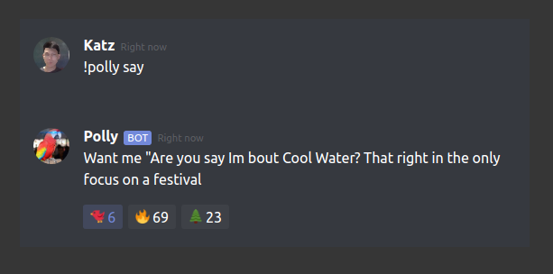

# react-discord-message

A react component that simulates the discord message UI

## Example



An interactive demo is available at https://pollybot.xyz

## Features

- Discord message w/ proper styles
- Customizable avatar
- Customizable date/time message
- Definable, interactive emoji reactions (w/ Twemoji, the same emoji set used by discord)
- Channel (#channelname) highlighting

## Upcoming Features

- [ ] Option to disable reaction interactivity
- [ ] End-user ability to add reactions
- [ ] Reaction animation
- [ ] Ability to use custom image as emoji

PR's welcome!

## Usage

```jsx
import DiscordMessage from "react-discord-message";
```

DiscordMessage Props:

| Prop      | Description                                                                                        |
| --------- | -------------------------------------------------------------------------------------------------- |
| username  | discord name                                                                                       |
| isBot     | whether to display the 'BOT' tag on the message                                                    |
| time      | faint time-string next to username                                                                 |
| body      | message body                                                                                       |
| avatar    | link to image OR [imported image](https://create-react-app.dev/docs/adding-images-fonts-and-files) |
| reactions | array of reaction javascript objects (see below)                                                   |

Reaction object fields:

| Field   | Description                                                                      |
| ------- | -------------------------------------------------------------------------------- |
| emoji   | String of the given emoji - use the emoji itself, not it's id. Example: "🔥"     |
| num     | How many times the given reaction has been clicked                               |
| clicked | Whether the reaction has been clicked by the user. Optional, defaults to {false} |

See below for examples

### Basic message

```JSX
<DiscordMessage
    username="Katz"
    isBot={false}
    time="Right now"
    body="Hey! Thanks for checking out this component!"
    avatar="https://pbs.twimg.com/profile_images/1009305542026657792/iZg9qfK7_400x400.jpg"
/>
```

### Message with reactions

```JSX
<DiscordMessage
    username="Katz"
    isBot={false}
    time="Right now"
    body="Hey! Thanks for checking out this component!"
    avatar="https://pbs.twimg.com/profile_images/1009305542026657792/iZg9qfK7_400x400.jpg"
    reactions={[
        {
        emoji: "🐦",
        num: 6,
        clicked: true
        },
        {
        emoji: "🔥",
        num: 23,
        clicked: false
        }
    ]}
/>
```

## License

This project is licensed under the [MIT License](LICENSE.md). For more information on what this means, [click here](https://en.wikipedia.org/wiki/MIT_License).
